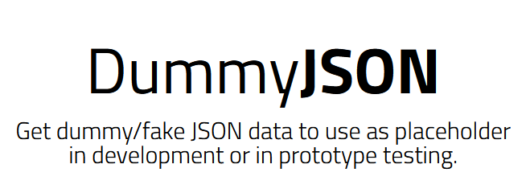

<div align="center">
  <a href="">
    
  </a>

  <p align="center">
    API Testing with RestAssured and SerenityBDD
    <br />
    <a href="https://dummyjson.com/"><strong>| DummyJSON |</strong></a>
    <br />
    <br />
  </p>
</div>

## 📑 About the Project

<p align="justify">Ever wonder how you get information when typing on Google? Well there's a magic that we called API as a "Waitress" for your evening data-looking across the internet ready to serve you. Fundamentally, it's important to make sure that API is working, isn't? Welcome to very our API Testing repository. Originally as a Group Project, our repository can be purposed as boilerplate too. Happy cracking then! </p>

<!--
## 📓 Testing Documentation
[Test Case For WebUI](https://docs.google.com/spreadsheets/d/1O6KXBNgfuOaJJmRbachmq_b3TQBppHi5DMILPnsZIZk/edit?pli=1#gid=1278518793)
-->
<!--
## 📝 Reports

#### Login


#### Register


#### Chats

-->

## 🛠 Tools

**Automation :**


**Test Case Management:**  


**Communication:**  


## 📱 Behind the Door

  [](https://www.linkedin.com/in/rahdianabdi/)
  [](https://github.com/rahdian-abdi)

  [](https://www.linkedin.com/in/todoantodoan/)
  [](https://github.com/eltodoan)
  
  [](https://www.linkedin.com/in/havidnursahgandi/)
  [](https://github.com/hvdn)
<!--
# Testing Documentation
Testing documentaion for Manual Testing (https://docs.google.com/spreadsheets/d/1O6KXBNgfuOaJJmRbachmq_b3TQBppHi5DMILPnsZIZk/edit?pli=1#gid=1278518793)
-->
## How to run the test
To run the this project, you can either just run the `CucumberTestSuite` test runner class, or run `mvn verify` from terminal.

This is how you run it :

1. Clone the repository
```json
$ git clone https://github.com/ProjectBengcall/web-testing.git
```
2. In case there is a poput asked whether the project based on Maven or Gradle, choose Maven
3. Run this on the IDE terminal
```json
$ mvn clean verify
```

By default, the tests will run using Chrome. You can run them in Firefox by overriding the `driver` system property, e.g.
```json
$ mvn clean verify -Ddriver=firefox
```

The test results will be recorded in the `target/site/serenity` directory.
